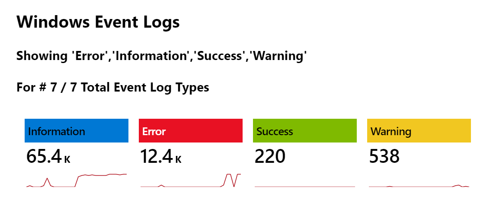
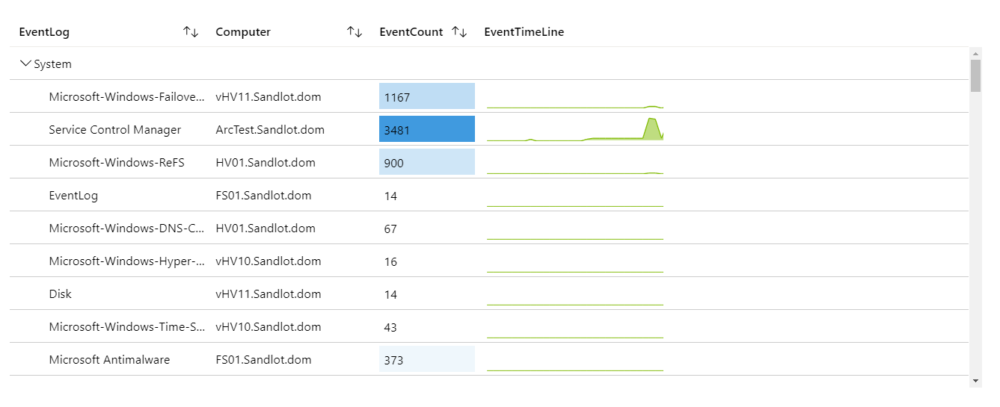
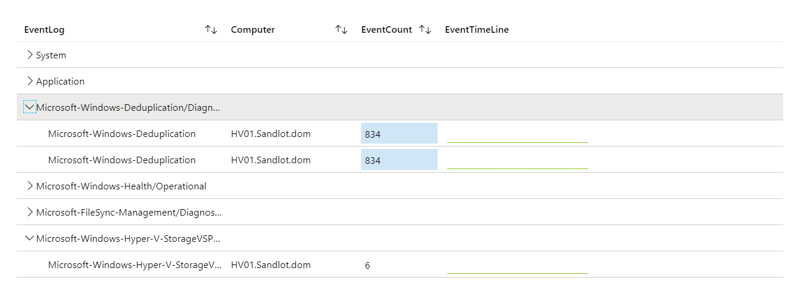
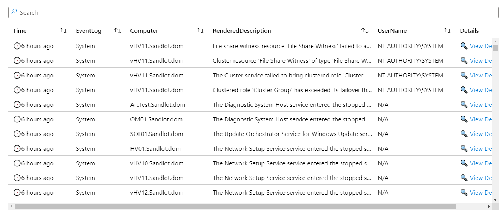
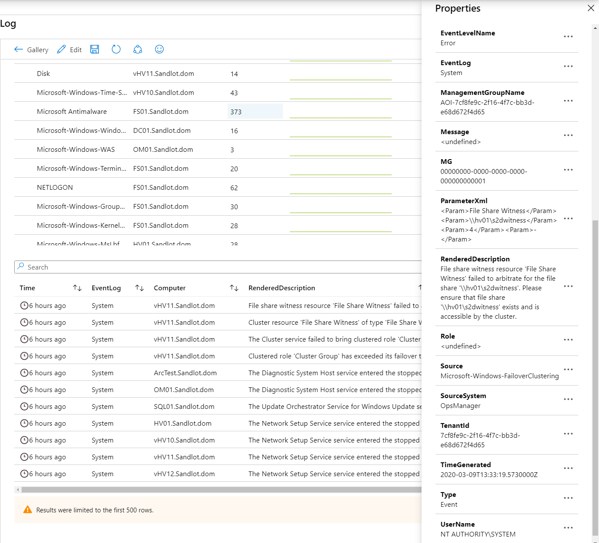

# Azure Monitor Event Log Workbook

### Purpose
Provides consolidation for Event Logs across all your servers.

### Requirements
Log Analytics
Log Analytics agent installed on desired server(s)
Event Logs collection

### Related Blog Post
https://www.systemcenterautomation.com/2020/03/azure-monitor-event-log-workbook/

### Screen Grabs

### Notes
You may have to change the Subscription parameter from default to all subscriptions. I've noticed importing some workbooks that it may switch it from All to Default.

